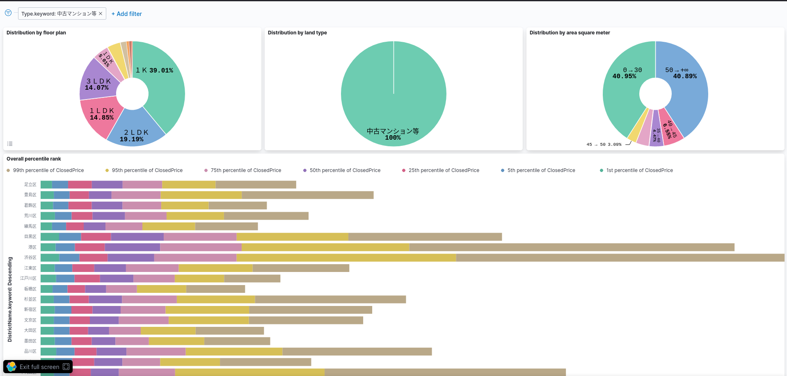
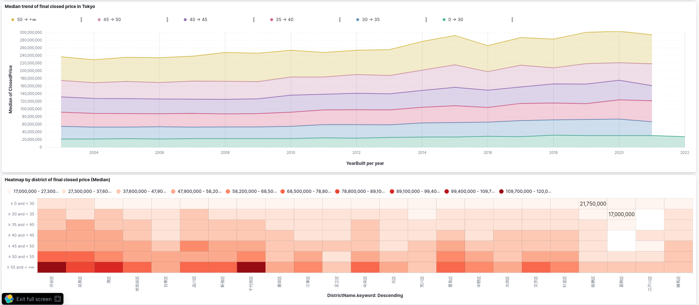

# pipeline


* [Motivation](#motivation)
* [Available pipelines](#available-pipelines)
  * [Downloading real-estate data](#downloading-real-estate-data)
* [Sample dashboard using kibana](#sample-dashboard-using-kibana)
  * [Real Estate](#real-estate)
* [Getting started](#getting-started)
* [Conventions](#conventions)
  * [Commit message](#commit-message)
* [Sample infrastructure]

## Motivation

A pipeline powered by apache beam for general use.  
I would like to introduce this as practical example.

## Available pipelines

### Downloading real estate data

This pipeline targets mansion price in Japan which is downloaded from [MLIT](https://www.land.mlit.go.jp/webland/servlet/MainServlet).  
Data will be indexed into elasticsearch.

## Sample dashboard using kibana

### Real Estate




## Getting Started

1. Build image
```markdown
make build
```

2. Run app
```markdown
docker run --rm pipelines:latest
```

## Conventions

### Commit message

I follow [conventional commits](https://www.conventionalcommits.org/en/v1.0.0/#summary).

## Sample infrastructure

There is a sample terraform script for you to build infrastructure on Google cloud.  
You could use this when running on dataflow.

```markdown
cd scripts/terraform
export TF_VAR_project=MY_PROJECT
export TF_VAR_region=MY_REGION

terraform plan
terraform apply
```